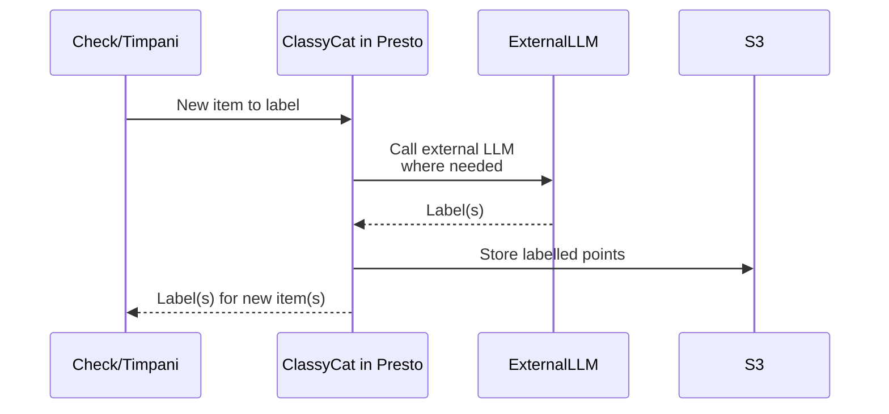
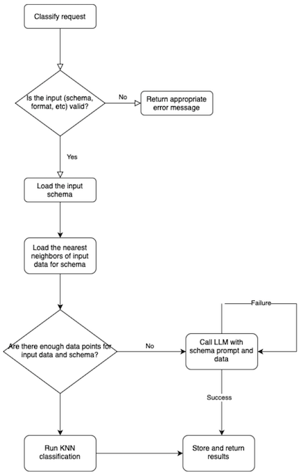

# ClassyCat design decisions and notes

## ClassyCat in Presto (initial version)
ClassyCat is implemented in Presto and stores data in S3 for future use




## Request and response JSON examples:
### Create Schema
- Input:

```json
{
  "model_name": "classycat__Model",
  "body": {
    "id": 1200,
    "parameters": {
      "event_type": "schema_create",
      "schema_name": "2024 Indian Election Test",
      "topics": [
        {
          "topic": "Politics",
          "description": "This topic includes political claims, attacks on leaders and parties, and general political commentary."
        },
        {
          "topic": "Communalism",
          "description": "This topic covers attack on religious minorities, statements on religious freedom and polarization."
        }
      ],
      "examples": [
        {
          "text": "Congress Manifesto is horrible. Never seen such a dangerous manifesto in my life. It's like vision 2047 document of PFI\n\nCheck these points of manifesto\n\n1. Will bring back triple talak (Muslim personal law)\n2. Reservation to Muslim in govt n private jobs (Implement Sachchar committee report)\n3. Support Love Jihad (right to love)\n4. Support Burqa in school (right to dress)\n5. End majoritarianism (Hinduism)\n6. Ban bulldozer action\n7. Support Gaza (Hamas)\n8. Legalise Same Sex Marriage, gender fluidity, trans movement\n9. Increase Muslim judges in judiciary\n10. Communal violence bill (will stop mob lynching)\n11. Legalise beef (right to eat everything)\n12. Separate loan intrest for Muslims\n13. Allow treason (No sedition)\n\nAll those Hindu who are thinking to vote Indi Alliance, NOTA or independent. Read this and think.\n",
          "labels": [
            "Politics",
            "Communalism"
          ]
        }
      ],
      "languages": [
        "English",
        "Hindi",
        "Telugu",
        "Malayalam"
      ]
    },
    "callback_url": "http://example.com?callback"
  }
}
```

- Output (callback):
```json
{
  "body": {
    "id": 1200,
    "content_hash": null,
    "callback_url": "http://host.docker.internal:9888",
    "url": null,
    "text": null,
    "raw": {},
    "parameters": {
      "event_type": "schema_create",
      "schema_name": "2024 Indian Election Test 2",
      "topics": [
        {
          "topic": "Politics",
          "description": "This topic includes political claims, attacks on leaders and parties, and general political commentary."
        },
        {
          "topic": "Communalism",
          "description": "This topic covers attack on religious minorities, statements on religious freedom and polarization."
        }
      ],
      "examples": [
        {
          "text": "Congress Manifesto is horrible. Never seen such a dangerous manifesto in my life. It's like vision 2047 document of PFI\n\nCheck these points of manifesto\n\n1. Will bring back triple talak (Muslim personal law)\n2. Reservation to Muslim in govt n private jobs (Implement Sachchar committee report)\n3. Support Love Jihad (right to love)\n4. Support Burqa in school (right to dress)\n5. End majoritarianism (Hinduism)\n6. Ban bulldozer action\n7. Support Gaza (Hamas)\n8. Legalise Same Sex Marriage, gender fluidity, trans movement\n9. Increase Muslim judges in judiciary\n10. Communal violence bill (will stop mob lynching)\n11. Legalise beef (right to eat everything)\n12. Separate loan intrest for Muslims\n13. Allow treason (No sedition)\n\nAll those Hindu who are thinking to vote Indi Alliance, NOTA or independent. Read this and think.\n",
          "labels": [
            "Politics",
            "Communalism"
          ]
        }
      ],
      "languages": [
        "English",
        "Hindi",
        "Telugu",
        "Malayalam"
      ]
    },
    "result": {
      "responseMessage": "success",
      "schema_id": "e6729bb9-2491-47dc-824d-828d929ebcd2"
    }
  },
  "model_name": "classycat.Model",
  "retry_count": 0
}
```

### Schema Look Up:
- Input:
```json
{
  "model_name": "classycat__Model",
  "body": {
    "callback_url": "http://example.com?callback",
    "id": 1200,
    "parameters": {
      "event_type": "schema_lookup",
      "schema_name": "2024 Indian Election Test"
    }
  }
}
```

- Output (callback):
```json
{
  "body": {
    "id": 1200,
    "content_hash": null,
    "callback_url": "http://host.docker.internal:9888",
    "url": null,
    "text": null,
    "raw": {},
    "parameters": {
      "event_type": "schema_lookup",
      "schema_name": "2024 Indian Election Test"
    },
    "result": {
      "responseMessage": "success",
      "schema_id": "12589852-4fff-430b-bf77-adad202d03ca"
    }
  },
  "model_name": "classycat.Model",
  "retry_count": 0
}
```

### Classify
- Input:
```json
{
  "model_name": "classycat__Model",
  "body": {
    "id": 1200,
    "parameters": {
      "event_type": "classify",
      "schema_id": "4a026b82-4a16-440d-aed7-bec07af12205",
      "items": [
        {
          "id": "11",
          "text": "modi and bjp want to rule india by dividing people against each other"
        }
      ]
    },
    "callback_url": "http://example.com?callback"
  }
}
```

- Output (callback):
```json
{
  "body": {
    "id": 1200,
    "content_hash": null,
    "callback_url": "http://host.docker.internal:9888",
    "url": null,
    "text": null,
    "raw": {},
    "parameters": {
      "event_type": "classify",
      "schema_id": "12589852-4fff-430b-bf77-adad202d03ca",
      "items": [
        {
          "id": "11",
          "text": "modi and bjp want to rule india by dividing people against each other"
        }
      ]
    },
    "result": {
      "responseMessage": "success",
      "classification_results": [
        {
          "id": "11",
          "text": "modi and bjp want to rule india by dividing people against each other",
          "labels": [
            "Politics",
            "Communalism"
          ]
        }
      ]
    }
  },
  "model_name": "classycat.Model",
  "retry_count": 0
}
```


## Notes

- We will implement Classy Cat inside Presto, which supports asynchronous callbacks
- We will respond with the appropriate error codes and messages in case of failures
- Classy Cat will accept classify requests in batches. To submit a single item request, simply submit a batch request of size 1.
- The maximum batch size for Classy Cat is 25
- For now, users of Classy Cat may choose how they would respond to requests not being serviced in case of failures
- For now, the scope of Classy Cat remains limited to classification through the use of LLMs. In future, we will consider implementing a KNN classification based on previous classifications. We currently will only store the LLM classification results, without making any local decisions.
- Presto will be OK to handle storage and state needs of Classy Cat
- Classy Cat will only call one call back URL per request
- Every ClassyCat response will include a message field (see example below). Upon success, that message will be “success”, otherwise it will contain the corresponding error message.
- The classification flowchart is as follows:

